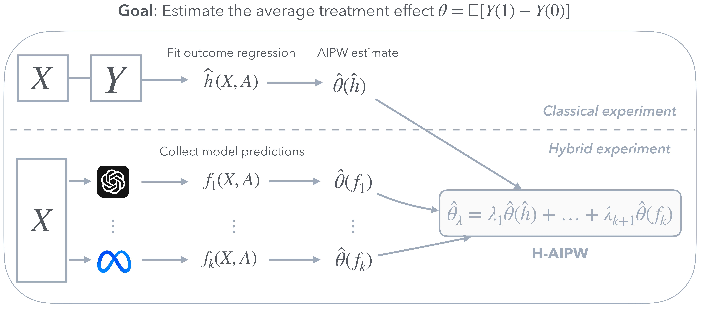

# Efficient Randomized Experiments Using Foundation Models

<!-- [](https://arxiv.org/abs/2412.06619) -->
[](https://python.org/downloads/release/python-3123/)
[](LICENSE)
[](https://pytorch.org/)

## Table of Contents
- [Overview](#overview)
- [Contents](#contents)
- [Getting Started](#getting-started)
- [Usage](#usage)
- [Contributing](#contributing)
- [Contact](#contact)
<!-- * [Citation](#citation) -->

---

## Overview



This repository contains the Python implementation of the **Hybrid Augmented Inverse Probability Weighting (HAIPW)** estimator, a novel estimator for the **Average Treatment Effect (ATE)** introduced in the paper *"Efficient Randomized Experiments Using Foundation Models"*.

### Key Features of HAIPW:
- **Integrates predictions from multiple foundation models (e.g. LLMs)** to improve statistical precision, leading to tighter confidence intervals.
- **Combines the standard AIPW estimator with LLM-generated AIPW estimates**, ensuring that the asymptotic variance is as small as the most precise estimator.
- **Maintains valid statistical inference** without requiring additional assumptions beyond those typically needed for standard estimation in randomized controlled trials (RCTs).
- **Supports both open-source (e.g., LLaMA) and proprietary (e.g., GPT-4, Claude) models**, making it adaptable across different research settings.

<!-- For more details, see our [research paper](https://arxiv.org/abs/2412.06619). -->

---

## Contents

The `HAIPW` folder contains the core package:

```bash
HAIPW/
│── faheyS78/                      # Data and preprocessing scripts for the study by Fahey et al.
│   ├── generate_outcomes_opensource.py   # LLM-based outcome generation (open models)
│   ├── generate_outcomes_propietary.py   # Outcome generation (proprietary models)
│   ├── utils_data.py                     # Data utilities
│── estimators.py                  # Implementation of AIPW, HAIPW, PPI, DiM estimators
│── utils.py                        # Logging, coverage computation, helper functions
│── create_data.py                   # Dataset generation script
│── run_experiment.py                # Main script to run experiments
```

---

## Getting Started

### **Dependencies**

This package requires **Python 3.12.3** and the following libraries:

```txt
numpy==2.2.2
pandas==2.2.3
torch==2.6.0
openai==1.61.0
anthropic==0.45.2
scikit-learn==1.6.1
scipy==1.15.1
tqdm==4.67.1
datasets==3.2.0
transformers==4.48.2
bitsandbytes==0.45.1
accelerate==1.3.0
```

### Installation

#### Step 1: Create and Activate a Conda Environment

```bash
conda create -n haipw_env python=3.12.3 -y
conda activate haipw_env
```
#### Step 2: Install the Package (2 Options)

1. **Local Installation:**
   Start by cloning the repository from GitHub. Then, upgrade `pip` to its latest version and use the local setup files to install the package.
   ```bash
   git clone https://github.com/jaabmar/HAIPW.git
   cd HAIPW
   pip install --upgrade pip
   pip install -e .
   ```
2. **Direct Installation from GitHub:**
   ```bash
   pip install git+https://github.com/jaabmar/HAIPW.git
   ```

---

## Usage

### Generating outcomes with LLMs

To generate synthetic data using an LLM:

```bash
python create_data.py --model_name llama_small --study_name faheyS78
```

#### Arguments

- `--model_name`: Choose from (`gpt4o`, `claude_haiku`, `deepseek`, `llama`, `llama_small`)
- `--study_name`: The dataset/study to process

### Running an experiment

The main script `run_experiment.py` computes HAIPW and other estimators for the specified study.

Example command:

```bash
python run_experiment.py \
    --n_rct 100 \
    --n_features 5 \
    --n_folds 30 \
    --alpha_ridge 1.0 \
    --study faheyS78 \
    --model llama_small \
    --n_seeds 1000
```

#### Arguments

- `--n_rct`: Number of (subsampled) randomized controlled trial (RCT) samples
- `--n_features`: Number of features selected
- `--n_folds`: Number of cross-fitting folds for AIPW
- `--alpha_ridge`: Ridge regression regularization parameter
- `--study`: Dataset/study name
- `--model`: Model(s) to use (`gpt4o`, `claude_haiku`, `deepseek`, `llama`, `llama_small`)
- `--n_seeds`: Number of seeds for randomization
- `--n_prompts`: Number of prompts (inference-time compute)


## Contributing

We welcome contributions to improve this project. Here's how you can contribute:

1. Fork the repository
2. Create a new branch (`git checkout -b feature-branch`)
3. Make your changes and commit (`git commit -m "Description of change"`)
4. Push to your branch (`git push origin feature-branch`)
5. Open a Pull Request


## Contact

For questions or collaborations, feel free to reach out:

- Javier Abad Martinez - [javier.abadmartinez@ai.ethz.ch](mailto:javier.abadmartinez@ai.ethz.ch)
- Piersilvio de Bartolomeis - [piersilvio.debartolomeis@inf.ethz.ch](mailto:piersilvio.debartolomeis@inf.ethz.ch)
- Konstantin Donhauser - [konstantin.donhauser@ai.ethz.ch](mailto:konstantin.donhauser@ai.ethz.ch)

<!-- ## Citation

If you find this code useful, please consider citing our paper:
 ```
@article{abadcopyright2024,
      title={Copyright-Protected Language Generation via Adaptive Model Fusion}, 
      author={Javier Abad and Konstantin Donhauser and Francesco Pinto and Fanny Yang},
      year={2024},
      journal={arXiv preprint arXiv:2412.06619},
}
``` -->
